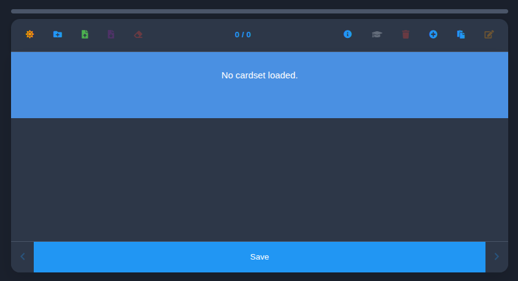
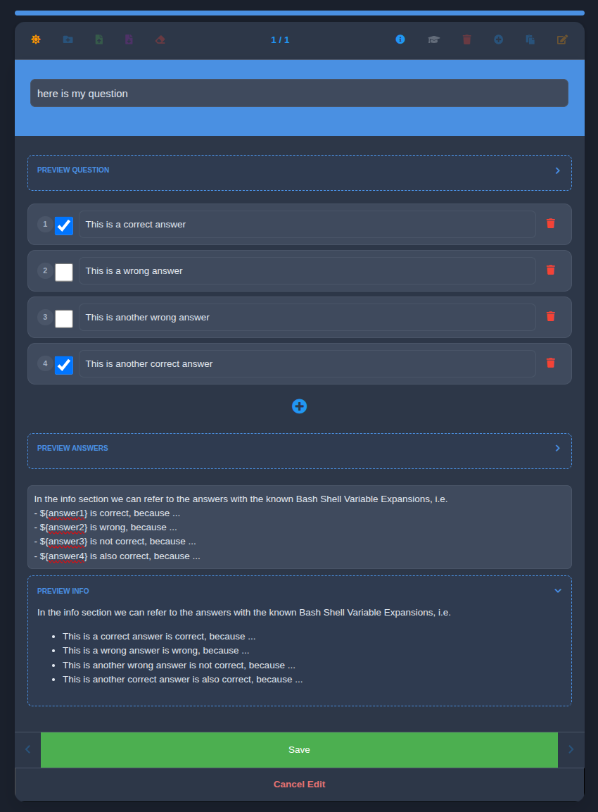
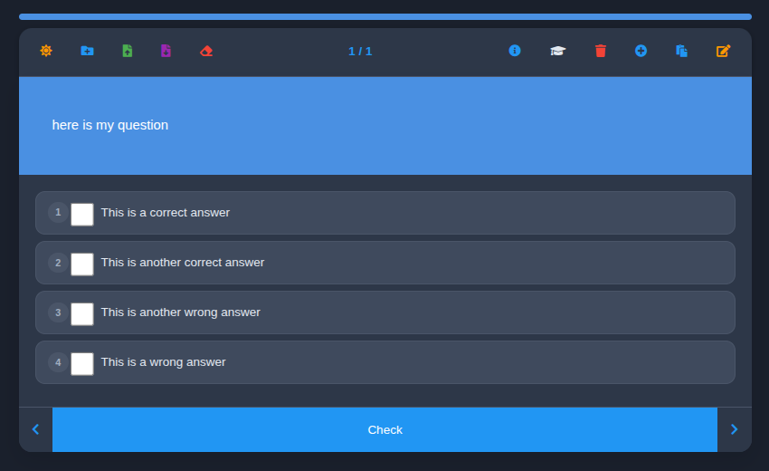

# ctlabs-tools — Flashcards

A lightweight, multimedia flashcard application designed for rapid learning, automated testing, and seamless data portability. Running entirely in-memory with local fallback protection, it gives you full control over your cardsets without external database dependencies.



## Features

* **Dual Interaction Modes:** Switch fluidly between **Study Mode** for memorization and **Quiz Mode** for evaluation.
* **Dynamic Shuffling:** Answers are automatically randomized every single time a card is loaded to prevent positional memory bias.
* **Smart Auto-Parsing:** Supports importing individual cards via simple copy/paste from plain text files with automatic parsing mechanics.
* **Portability & JSON Standard:** Entire cardsets are defined, imported, and exported as clean, readable JSON structures.
* **In-Memory Lifecycle with Crash Resilience:** Runs completely in system memory for speed, while simultaneously utilizing `localStorage` to ensure your session is preserved in the event of a browser crash. The local cache can be purged at any time.
* **Responsive UI:** Full native support for both **Dark Mode** and **Light Mode**.

---

## Development & Local Setup

The application includes a local Python-based CLI utility to instantly serve the frontend assets and automatically launch your environment.

### Prerequisites & CLI Usage

```bash
sh$ flashcards -h
usage: flashcards [-h] [-H HOST] [-p PORT] [--no-browser]

Run the Flashcards app locally

optional arguments:
  -h, --help            show this help message and exit
  -H HOST, --host HOST  Host IP to bind to (default: 127.0.0.1)
  -p PORT, --port PORT  Port to bind to (default: 8000)
  --no-browser          Do not automatically open the web browser
```

---

## Edit Mode (Card Templating)

When adding or modifying a card, you can leverage dynamic variable placeholders. The application parser handles variable tokens **case-insensitively**.



### Built-in Variables

You can use the following variable patterns interchangeably within your card definitions:

* **Answers:** `${answer1}`, `${ANSWER2}`, `${answer:3}`, `${Answer:4}`
* **Index Tracking:** `${idx:1}`, `${Idx:2}`



---

## Importing Card Sets

Cardsets can be loaded globally or appended inline into your existing decks.

### Full Cardset Import
1. Navigate to the import utility in the user interface.
2. Provide your structured JSON configuration file.

### Individual Card Auto-Parsing
You can quickly copy/paste plain text snippets directly into the application. The internal engine will attempt to auto-detect delimiters and parse the text directly into a valid flashcard layout.

---

## Exporting Card Sets

Your data always belongs to you. You can append new cards to an existing active set and immediately export the updated layout.
* Exports are delivered as a standardized, clean ` .json ` payload.
* Saves state locally to your machine for safe archiving or sharing across environments.

---

## Quiz Mode

Quiz Mode evaluates your knowledge retention by tracking performance across your active deck.
* Leverages the automated answer shuffling engine to keep evaluations objective.
* *Provide additional specifics here regarding scoring, timers, or pass/fail conditions if applicable.*


